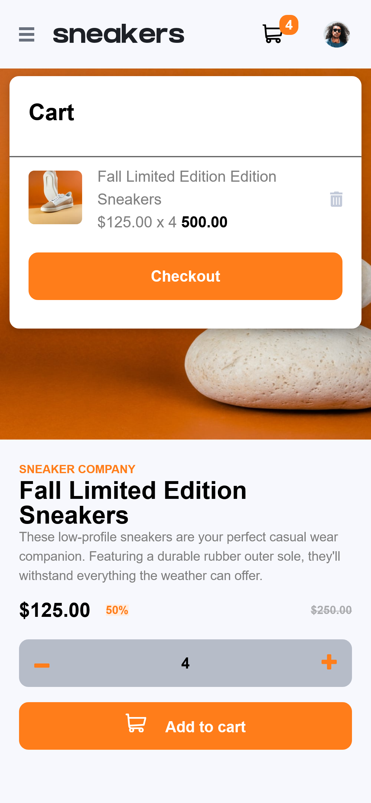

# Frontend Mentor - My E-commerce product page solution

This is a solution to the [E-commerce product page challenge on Frontend Mentor](https://www.frontendmentor.io/challenges/ecommerce-product-page-UPsZ9MJp6). Frontend Mentor challenges help you improve your coding skills by building realistic projects.

## Table of contents

- [Overview](#overview)
  - [The challenge](#the-challenge)
  - [Screenshot](#screenshot)
  - [Links](#links)
- [My process](#my-process)
  - [Built with](#built-with)
  - [What I learned](#what-i-learned)
  - [Continued development](#continued-development)
  - [Useful resources](#useful-resources)
- [Author](#author)
- [Acknowledgments](#acknowledgments)

## Overview

### The challenge

Users should be able to:

- View the optimal layout for the site depending on their device's screen size
- See hover states for all interactive elements on the page
- Open a lightbox gallery by clicking on the large product image
- Switch the large product image by clicking on the small thumbnail images
- Add items to the cart
- View the cart and remove items from it

### Screenshot

### Links

- Solution URL: [Add solution URL here](https://github.com/drew-chidi/ecommerce-product-page)
- Live Site URL: [Add live site URL here](https://ecommerce-product-page-drew.netlify.app/)

## My process

### Built with

- Semantic HTML5 markup
- CSS custom properties
- Flexbox
- Mobile-first workflow
- [React](https://reactjs.org/) - JS library
- [Styled Components](https://styled-components.com/) - For styles

### What I learned

I have deeper understanding of how to use negative margins, flexbox and positions.

### Continued development

I will read up on the style property, position, and I look forward to working on projects where I will apply positioning.

### Useful resources

- [How to use CSS Media Query Breakpoint in Styled-Components](https://dev.to/cagatayunal/how-to-use-css-media-query-breakpoint-in-styled-components-9of) - This helped me to apply media queries to the project. I really liked this pattern and will use it going forward.

## Author

- Website - [Andrew Ofuenweuche](https://drew-portfolio.netlify.app/)
- Frontend Mentor - [@drew-chidi](https://www.frontendmentor.io/profile/drew-chidi)
- Twitter - [@first_name_gr8](https://www.twitter.com/first_name_gr8)
